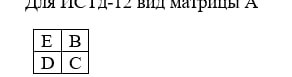
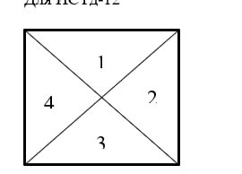
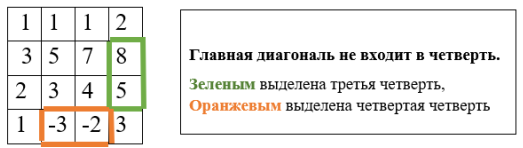
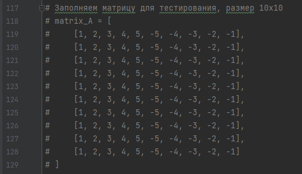

# Лабораторная работа №3 "Операции с матрицами"

## Задание для 14 Варианта.
>С клавиатуры вводится два числа K и N.
Квадратная матрица А(N,N), состоящая из 4-х равных по размерам подматриц, B,C,D,E заполняется случайным образом целыми числами в интервале [-10,10].
Для тестирования использовать не случайное заполнение, а целенаправленное.

>Формируется матрица F следующим образом: если в B количество чисел, меньших К в в нечетных столбцах в области 3 больше,
чем сумма  элементов в четных столбцах в области 2, то поменять в Е симметрично области 3 и 2 местами,
иначе В и Е поменять местами несимметрично.
При этом матрица А не меняется. После чего вычисляется выражение: (К*А)*F-K*A^T.
Выводятся по мере формирования А, F и все матричные операции последовательно.

## Вид матрицы 

## Вид областей

### _Главные диаганали при разделение на области не учитываются_ 

### _Для тестированния нужно заполнить матрицу расположенную на 117 строчке кода_ 

